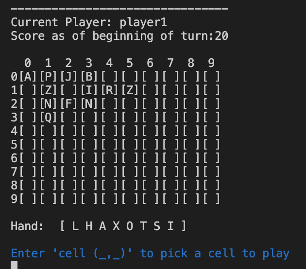

We will be demo-ing our Scrabble inspired game in utop. 
Since this game is multiplayer (2), the grader will  have to play as both players (Player1, Player2). 

The goal of the game is to take turn creating words from your hand of tile letters until a player achieves the "winning score" (can be changed on line 12 of state.ml for faster testing purposes if needed).  The longer the words, the rarer the tiles, the more points! 

**INSTRUCTIONS**

**Start Game**

1. Navigate to our folder and type "make play" to start the game

2. Type "start" to begin the game. The available commands/instructions are listed at the beginning of the game. 

**Valid Move**

3. Make a word: As Player1, type "cell (x,y)" coordinate to place "tile _" of choice from your hand of available tiles. 
    ***Note: a valid move means all tiles placed on board are either in same column or row, touching a pre-existing tile on the board. Any violations will be caught later via "check" command.

4. Repeat step 3 as many times as needed. Please create this word 

5. Once Player1's word is created, type "check"

6. Switching players, Player2 will now type either "valid" or "invalid" to confirm the word created. Type "valid".

**Invalid Move**

7. For Player2, repeat steps 3-5 again.

8. When Player1 is checking the word though, type "invalid".

**Remove Tile**

9. As Player2, select a board cell with a tile in it by typing "cell (x,y)"

10. When prompted for the tile input, type "remove" instead. This will remove the tile at that cell.

11. Type "check" again.

12. Player1 type "valid"

**Skip Your Turn**

13. Player1 will now type "stuck" to skip their turn. 

**Complex Input**

14. Test a complex input which involves multiple new words being made when tiles are put down in a given move. This demonstrates the robustness of our program to find new words
    a. For example, this first image shows a sample initial state for this testing:
    

    b. Adding tile L to (cell (1,0) and tile H to cell (1,2) shows all vertical and horizontal words made as a result of this play

    

**Quit Game**

15. Type "quit" to quit the game anytime.